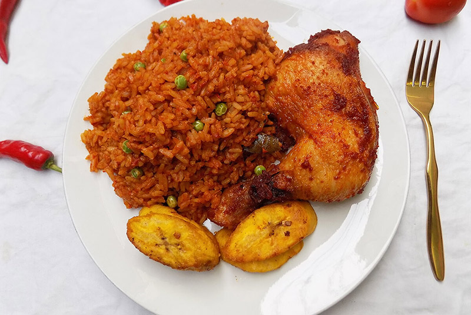

# CODING CLASS COOKS
This is a git repository we use to learn about git by creating recipes

## JOLLOF RICE RECIPE

The dish is a staple across west africa, with each country and region boasting it's own unique variations and preferred methods of preparations.

### ABOUT THE RECIPE
It's a popular west africa dish, known for it's vibrant color, rich taste, and spicy kick.

### LIST OF INGREDIENTS
Red bell peppers, Vine tomatoes, Red onion, Red scotch bonnet, Garlic, Fresh ginger, Vegetable oil, Double concentrated tomato puree(DeRica), Curry powder, Dried thyme, Chicken stock cubes, Dried bay leaves, White basmati rice.

### PREPARATION

FOR THE BASE.

1 Large red bell pepper ,cut into small pieces.

2 Medium inetomatoes,cut into small pieces.

1 Red onion, quatered.

2 Red scotch bonnet chillies, quatered.

3 Garlic cloves, smashed.

25g  Fresh ginger, peeled and roughly chopped.

100ml water.

FOR THE RICE.

150ml vegetable oil.

1 Red onion, fiely chopped.

150g doubleconcentrated tomato puree(we use DeRica).

1 tbsp curry powder.

1 tsp dried thyme.

3 chicken stock cubes.

2 dried bay leaves.

600ml water.

600g white basmati rice.

### THE COOKING

Place the base ingredients in a blender and blitz until smooth.

Heat the vegetable oil in a large dutch oven set over medium heat. Add the onion and cook, stirring occasionally for (3) three minutes, then add the tomato puree and cook, stirring frequently until it begins to darken,(3) three -(5) minutes.

Pour in the blended base,stir to combine and bring to a simmer. Reduce the heat to medium- low and partially cover the pot with the lid - (it will splatter !) cook,stirring occasionally, until the sauce is reduced.

Stir in the curry powder, thyme, stock cubes, bay leaves and water, season generously with salt and peppers to taste, then cover and bring to a boil over medium - high heat

Meanwhile, rinse the rice throughly with cold water until the water runs clean, then drain. Add the rice to the sauce and stir to combine. As soon as it comes to 

### WHAT IT LOOKS LIKE

Vibrant, Reddish-orange hue (which comes from the combination of TOMATOES, RED BELL PEPPERS and sometimes SCOTCH BONNET PEPPERS).

### WHAT YOU CAN ADD
VEGETABLE, PLANTIAN